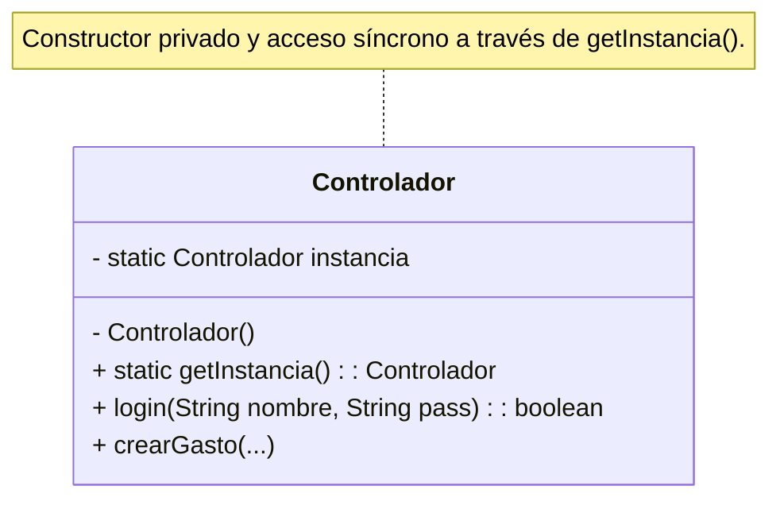
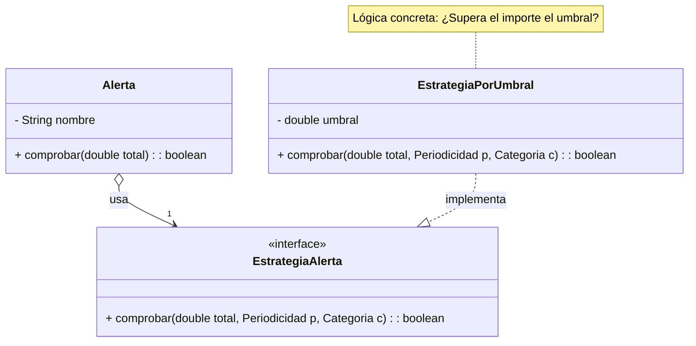
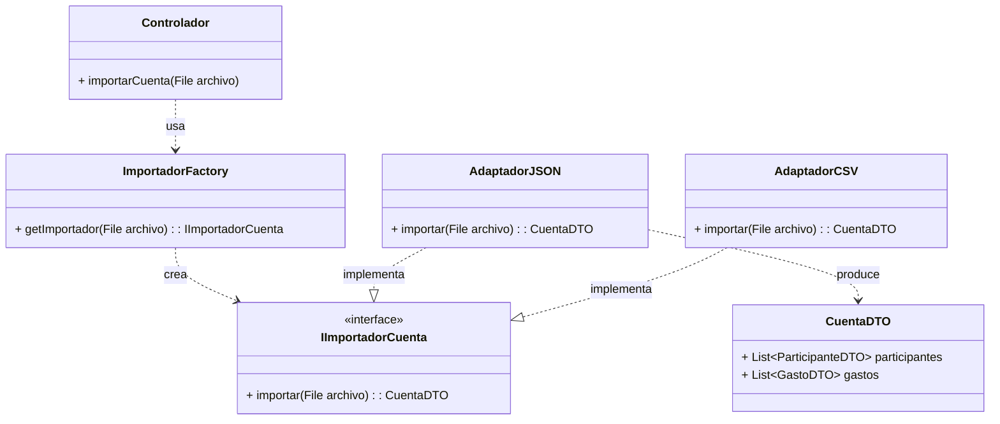
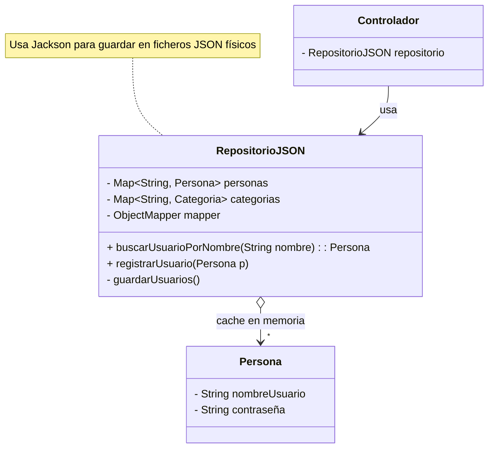

## 5. Explicación de los patrones de diseño usados

Aunque en el apartado de arquitectura se mencionaron brevemente los patrones seleccionados para resolver problemas estructurales y de comportamiento, 
en esta sección profundizaremos en su implementación técnica, justificando su necesidad y analizando cómo interactúan las clases implicadas.

### 5.1. Patrón Singleton (Creacional)

**Propósito:** Garantizar que una clase tenga una única instancia y proporcionar un punto de acceso global a ella.

* **Implementación en el proyecto:**
La clase `Controlador` es el componente central que maneja la lógica de negocio y mantiene el estado de la sesión (usuario autenticado). Si existieran múltiples
instancias del controlador, podríamos tener inconsistencias graves, como dos sesiones de usuario abiertas simultáneamente o desincronización con el repositorio de
datos.
Para evitar esto, se ha privatizado el constructor de la clase y se proporciona el método estático `getInstancia()`. La implementación es segura en hilos
mediante el uso de `synchronized` en el método de acceso, previniendo condiciones de carrera si la interfaz
gráfica intentara acceder al controlador desde múltiples hilos de ejecución.

---

### 5.2. Patrón Estrategia (Comportamiento)

**Propósito:** Definir una familia de algoritmos, encapsular cada uno de ellos y hacerlos intercambiables. Permite que el algoritmo varíe independientemente de 
los clientes que lo usan.

* **Contexto de uso:**
El sistema de alertas requiere flexibilidad para definir cuándo debe dispararse una notificación. Un usuario podría querer una alerta cuando el gasto supere
un "tope fijo" (umbral), mientras que en el futuro podría querer una alerta basada en la "variación respecto al mes anterior".
* **Participantes:**
* **Contexto:** La clase `Alerta` mantiene una referencia a una estrategia y le delega la responsabilidad de la validación llamando a `estrategia.comprobar()`.
* **Estrategia (Interfaz):** `EstrategiaAlerta` define el contrato común para todas las reglas de validación.
* **Estrategia Concreta:** `EstrategiaPorUmbral` implementa la lógica específica de comparar el gasto acumulado contra un límite numérico fijo.
* Esta estructura cumple con que podemos añadir nuevas formas de calcular alertas sin modificar el código de la clase `Alerta`.

---

### 5.3. Patrón Método Factoría y Adaptador (Estructurales)

Estos dos patrones trabajan en conjunto en el módulo `es.um.gestiongastos.importer` para resolver el problema de la importación de datos desde fuentes 
heterogéneas (JSON, CSV, YAML).

#### A. Método Factoría (Factory Method)

**Propósito:** Definir una interfaz para crear un objeto, pero dejar que las subclases decidan qué clase instanciar.

* **Implementación:**
La clase `ImportadorFactory` actúa como una factoría simple. Recibe un archivo (`File`), analiza su extensión y decide qué clase concreta
debe instanciar y devolver (`AdaptadorJSON`, `AdaptadorCSV`, etc.). Esto libera al Controlador de conocer la lógica de selección del importador adecuado.

#### B. Patrón Adaptador (Adapter) y uso de DTOs

**Propósito:** Convertir la interfaz de una clase en otra interfaz que el cliente espera. Permite que clases con interfaces incompatibles trabajen juntas.
Las librerías de lectura de archivos (como Jackson para JSON o el lector de líneas para CSV) devuelven estructuras de datos que no coinciden con nuestro
Modelo de Dominio (clases `Gasto`, `Persona`, `GastosCompartidos`). Por ejemplo, nuestro modelo `Gasto` requiere objetos complejos como `Categoria` y `Persona`,
mientras que un archivo externo solo proporciona cadenas de texto ("Alimentación", "usuario_1").
* **Solución (Adaptador + DTO):**
Hemos definido la interfaz `IImportadorCuenta` y las clases `AdaptadorJSON` y `AdaptadorCSV` implementan esta
interfaz y realizan la adaptación en dos pasos:
1. **Mapeo a DTO (Data Transfer Object):** Los adaptadores no crean directamente entidades del dominio. Primero vuelcan los datos del archivo en objetos
contenedores simples (`CuentaDTO`, `GastoDTO`, `ParticipanteDTO`). Estos objetos actúan como buffer de transporte, soportando tipos primitivos (`String`, `double`)
que facilitan la serialización con librerías externas.
2. **Traducción:** Posteriormente, el Controlador toma estos DTOs y realiza la conversión final a Entidades, buscando las referencias reales en base de datos
(por ejemplo, convirtiendo el String "pablo" del DTO en el objeto `Persona` real recuperado del repositorio).

---

### 5.4. Patrón Repositorio (Acceso a Datos)

**Propósito:** Mediar entre el dominio y las capas de mapeo de datos, actuando como una colección de objetos en memoria.

* **Implementación:**
La clase `RepositorioJSON` oculta completamente los detalles de almacenamiento (archivos, serialización Jackson). Para el resto de la aplicación, el repositorio
parece una colección en memoria de objetos `Persona` y `Categoria`, ofreciendo métodos de dominio como `buscarUsuarioPorNombre()`. Esto desacopla la lógica de
negocio de la infraestructura de persistencia física.

