## 6. Manual de Usuario

La aplicación **Gestión de Gastos** es una herramienta diseñada para ayudarte a controlar tu economía personal y compartir gastos con amigos o compañeros de piso de forma sencilla. Para su correcto uso, explicaremos a continuación sus diferentes
ventanas e interfaces y la funcionalidad asociada a cada una de ellas:

---

### 6.1. Acceso y Registro

Al iniciar la aplicación, se mostrará la pantalla de inicio de sesión.

* **Si ya tienes cuenta:** Introduce tu usuario y contraseña y pulsa "Aceptar".

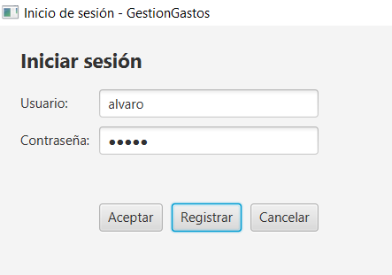

* **Si eres nuevo:** Pulsa el botón "Registrar" para crear un perfil. Deberás indicar tu nombre completo, un nombre de usuario único y una contraseña.

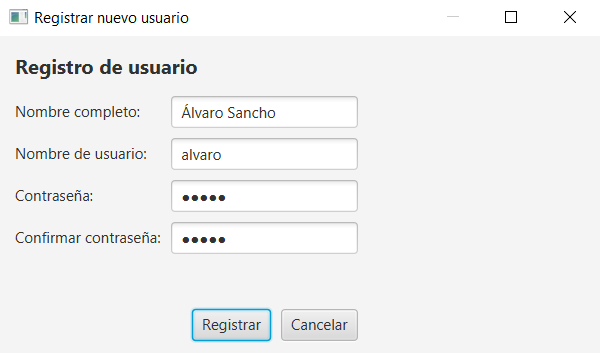

---

### 6.2. Gestión Diaria de Gastos

Esta es la pantalla principal, donde pasarás la mayor parte del tiempo. Aquí puedes ver tu historial y añadir nuevos movimientos. Para ilustrar la visualización de gastos hemos añadido una cuenta ya existente y un gasto a nuestra cuenta
personal. Por defecto, al crear un usuario se le asigna una cuenta personal para poder registrar gastos propios, además
de manejar gastos en cuentas compartidas.

1. **Registrar Gasto:** En la parte superior, rellena la descripción, el importe y la fecha. Selecciona una categoría (o crea una nueva escribiendo su nombre) e indica a qué **Cuenta Compartida** pertenece el gasto.
2. **Filtrar:** Usa la barra gris intermedia para buscar gastos por fechas, categoría o cuenta específica.

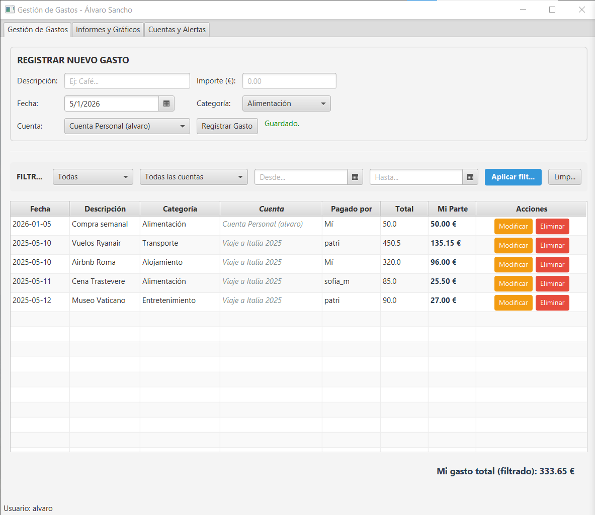

3. **Listado:** La tabla inferior muestra todos tus gastos. Puedes usar los botones de la derecha para **Modificar** o **Eliminar** un apunte erróneo.

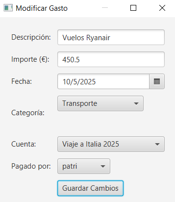

---

### 6.3. Cuentas Compartidas e Importación

En la pestaña "Cuentas y Alertas", encontrarás el panel izquierdo dedicado a los grupos de gasto.

* **Detalle:** Pulsa el botón azul `(i)` de una cuenta para ver quién debe dinero a quién y el saldo actual de cada miembro.
* **Importar:** Usa el botón naranja "Importar Archivo" para cargar gastos desde ficheros externos (CSV, JSON o YAML). Al
pulsar este botón se abrirá el explorador de archivos y podremos seleccionar archivos con cuentas ya existentes, como la que
hemos importado en el apartado anterior, proveniente de un JSON.
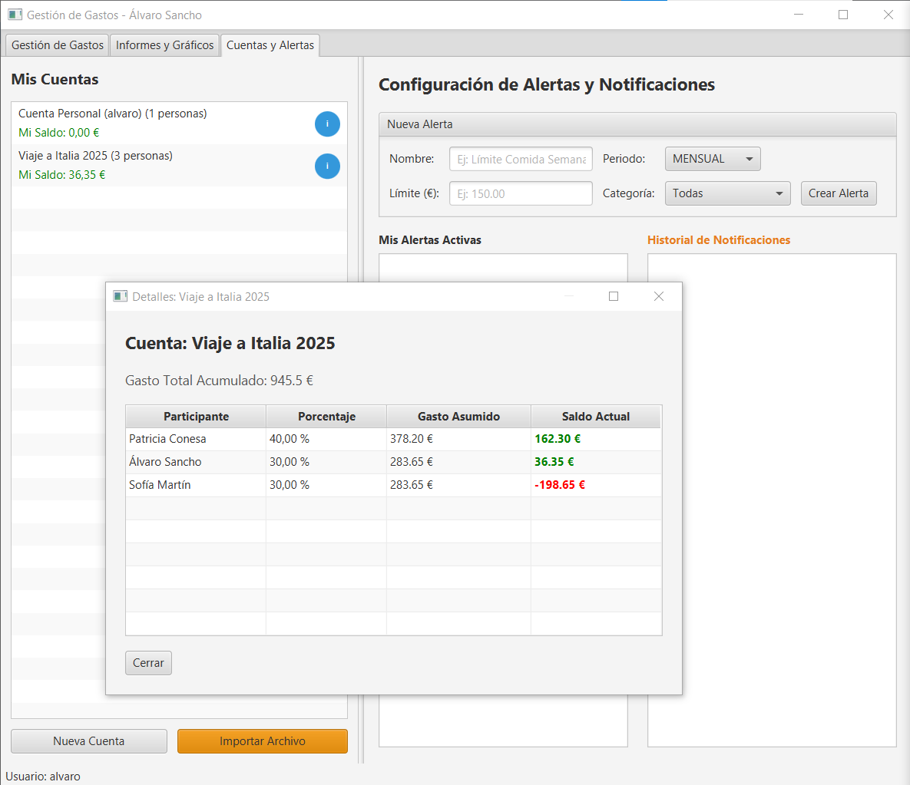
* **Crear Cuenta:** Pulsa "Nueva Cuenta" para iniciar el asistente. Podrás seleccionar a los participantes y definir si el reparto es equitativo
o por porcentajes personalizados.

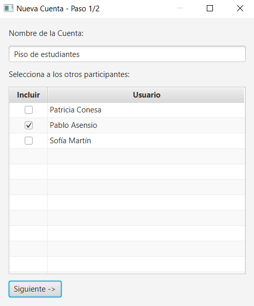
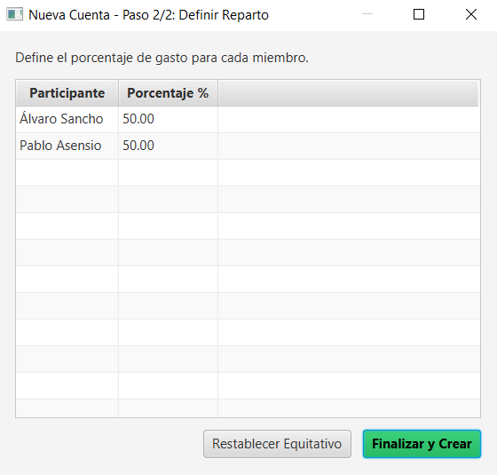

---

### 6.4. Informes y Gráficos

La pestaña "Informes" te ofrece una visión visual de tu economía:

* **Gráfico Circular:** Muestra qué porcentaje de tu dinero se va en cada categoría (Alimentación, Ocio, etc.).
* **Gráfico de Barras:** Muestra la evolución de tu gasto total a lo largo de los meses.
* **Total:** En la parte superior derecha verás el importe total acumulado de tus gastos personales.
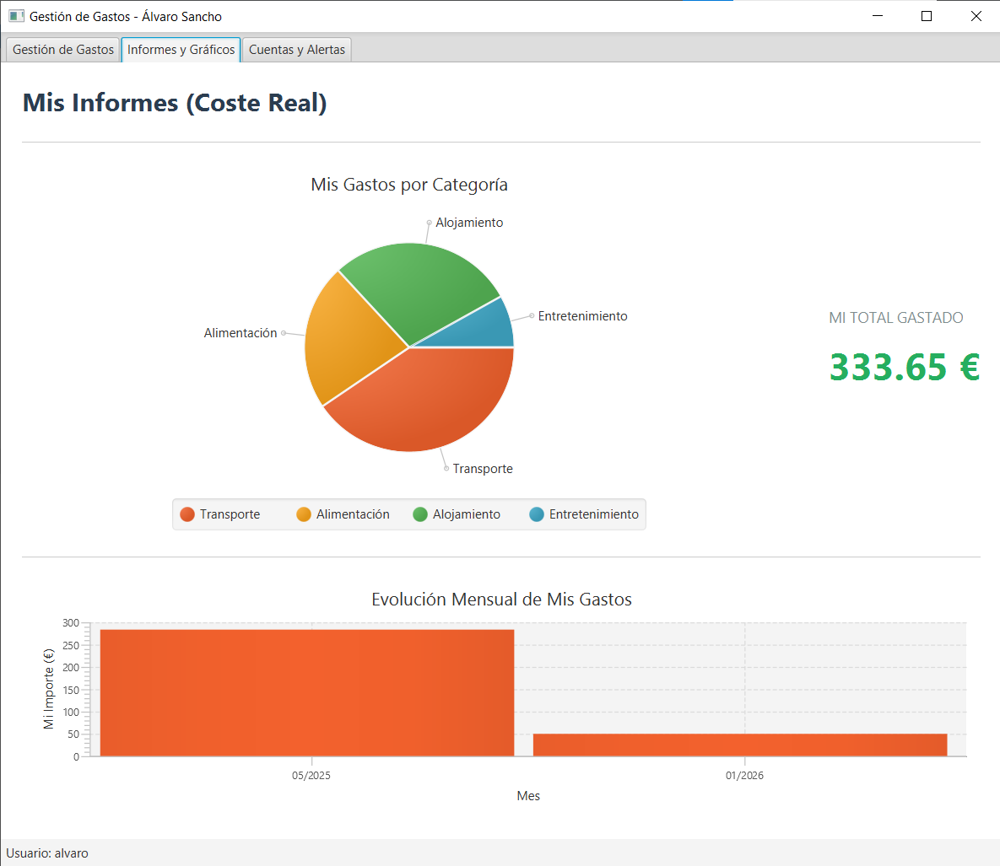

### 6.5. Sistema de Alertas

En la parte derecha de la pestaña "Cuentas y Alertas", puedes configurar avisos para no gastar de más. Para ilustrar la 
funcionalidad de esta pestaña crearemos una nueva Alerta, añadiremos un gasto para que se dispare la Notificación y 
observaremos cómo aparece en la lista:

1. **Nueva Alerta:** Define un nombre, un límite de dinero, una periodicidad (Semanal/Mensual) y opcionalmente una categoría.
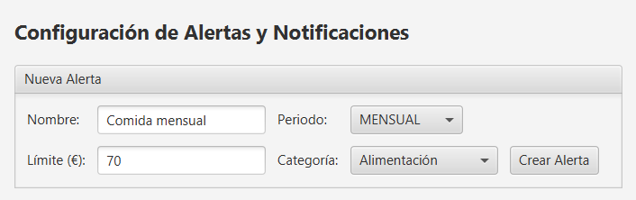
* Añadiremos un nuevo gasto en la pestaña de Gestión de Gastos para que se dispare la alerta que acabamos de crear
(mostramos los gastos filtrados correspondientes a la Categoría de la Alerta creada previamente):
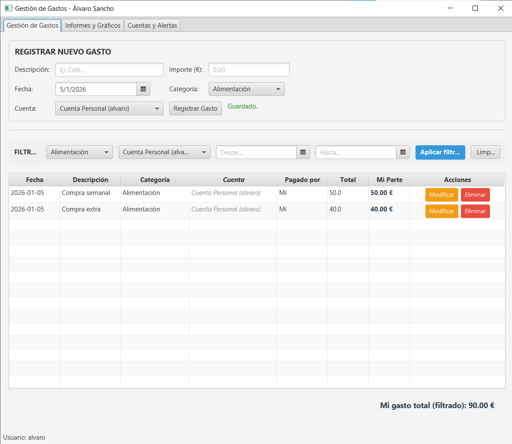
2. **Historial:** Si superas el límite, el sistema generará una notificación que aparecerá en la lista inferior derecha en color rojo.
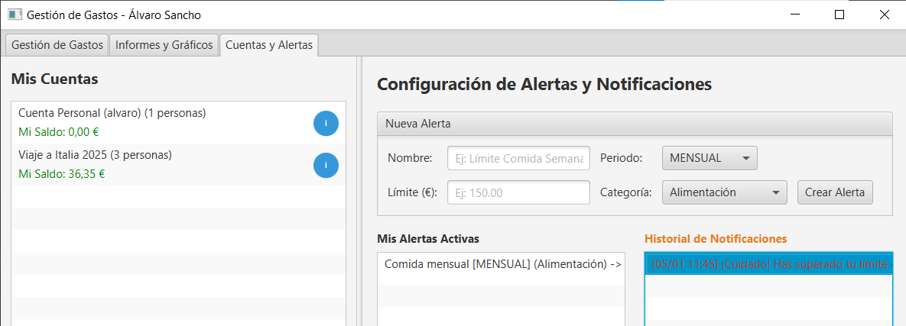
